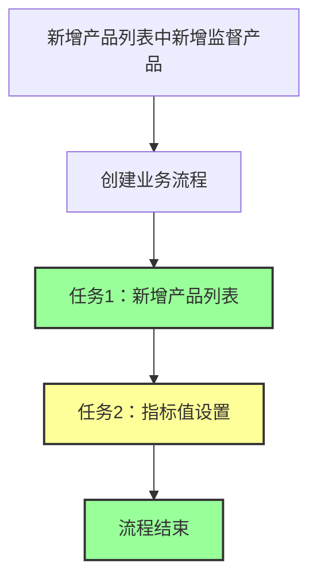
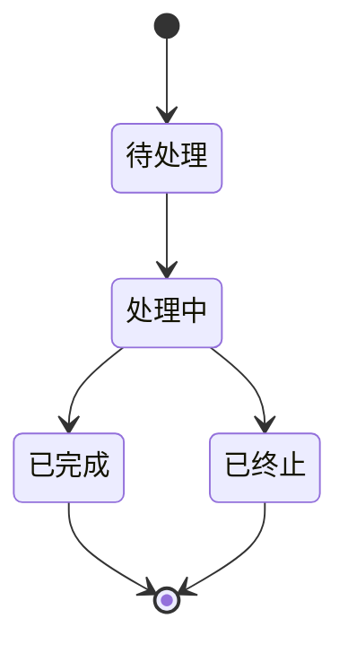

# 产品新增列表流程

## 1. 流程概述

产品新增列表流程是指根据新增产品列表中新增监督产品后创建的业务流程。该流程主要用于处理新产品的监督和管理，确保新产品能够顺利纳入日常监控体系。

### 1.1 流程特点

- **触发条件**：新增产品列表中新增监督产品
- **任务结构**：串行流程
- **任务数量**：2个主要任务环节
- **执行方式**：串行执行，简化流程管理

### 1.2 流程架构

产品新增列表流程包含以下任务环节：

1. **新增产品列表**（串行任务）
2. **指标值设置**（串行任务）

其中，任务1和任务2为串行执行，任务2完成后流程结束。指标值设置任务包含原流程中的指标值（新）、邮箱配置、特殊指标参数设置和白名单四个功能模块，可手工通过。

## 2. 流程架构图

## 3. 流程初始化

### 3.1 触发条件

当新增产品列表中新增监督产品时，系统自动触发产品新增列表流程的创建。

### 3.2 流程创建

系统根据新增的监督产品信息，创建一个新的业务流程实例，并初始化流程状态为"待处理"。

### 3.3 任务节点创建

流程创建后，系统按照以下顺序创建任务节点：

1. 首先创建"新增产品列表"任务节点，状态为"处理中"
2. "新增产品列表"任务完成后，创建"指标值设置"任务节点，状态为"处理中"

## 4. 任务环节详解

### 4.1 任务1：新增产品列表

**任务描述**：将新增的监督产品信息录入系统，建立产品基础档案。

**处理方式**：人工操作

**主要操作**：
1. 录入产品基本信息（产品名称、产品代码、产品类型等）
2. 设置产品所属产品组
3. 设置产品管理人类型
4. 设置产品委托人类型
5. 保存产品信息

**完成条件**：产品基本信息完整录入并保存成功。

**异常处理**：
- 如果产品信息不完整，系统提示补充完整
- 如果产品代码重复，系统提示修改产品代码

### 4.2 任务2：指标值设置

**任务描述**：为新增产品设置完整的监控指标配置，包括指标值、邮箱配置、特殊指标参数和白名单，确保产品能够纳入日常监控体系。

**处理方式**：人工操作，可手工通过

**主要操作**：
1. **指标值配置**：
   - 选择需要监控的指标类型
   - 设置各项指标的阈值和监控规则
   - 配置指标计算方法
   - 保存指标配置

2. **邮箱配置**：
   - 配置监控通知邮箱地址
   - 设置邮件通知规则（通知时间、通知内容等）
   - 配置邮件模板
   - 保存邮箱配置

3. **特殊指标参数设置**：
   - 识别产品的特殊监控需求
   - 设置特殊指标参数
   - 配置特殊指标的计算规则
   - 保存特殊指标参数设置

4. **白名单配置**：
   - 识别需要加入白名单的特殊情况
   - 设置白名单规则
   - 配置白名单生效条件
   - 保存白名单配置

**完成条件**：所有必要的指标值设置、邮箱配置、特殊指标参数设置和白名单配置完成并保存成功，或手工通过该任务。

**异常处理**：
- 如果指标值设置不合理，系统提示调整
- 如果缺少必要的指标配置，系统提示补充
- 如果邮箱地址格式不正确，系统提示修正
- 如果邮件通知规则设置不合理，系统提示调整
- 如果特殊指标参数设置不合理，系统提示调整
- 如果特殊指标计算规则配置错误，系统提示修正
- 如果白名单规则设置过于宽泛，系统提示调整
- 如果白名单生效条件配置不合理，系统提示修正
- 对于无法解决的配置问题，可手工通过任务，记录原因并继续流程

## 5. 流程状态转换

### 5.1 流程状态

产品新增列表流程包含以下状态：

1. **待处理**：流程已创建，但尚未开始处理
2. **处理中**：流程正在处理中
3. **已完成**：流程所有任务已完成
4. **已终止**：流程被异常终止

### 5.2 状态转换图

### 5.3 状态转换条件

1. **待处理 → 处理中**：流程开始执行，"新增产品列表"任务开始处理
2. **处理中 → 已完成**：所有串行任务（"新增产品列表"和"指标值设置"）均已完成
3. **处理中 → 已终止**：流程执行过程中出现严重异常，无法继续执行

## 6. 任务状态管理

### 6.1 任务状态

每个任务包含以下状态：

1. **处理中**：任务正在执行中
2. **已完成**：任务执行完成
3. **异常**：任务执行过程中出现异常
4. **退回**：任务被退回重新处理

### 6.2 任务状态转换

1. **处理中 → 已完成**：任务正常执行完成
2. **处理中 → 异常**：任务执行过程中出现异常
3. **处理中 → 退回**：任务被审核人员退回重新处理
4. **异常 → 处理中**：异常问题解决后，任务重新开始处理
5. **退回 → 处理中**：任务被重新处理

## 7. 异常处理

### 7.1 任务异常处理

当任务执行过程中出现异常时，系统采取以下处理方式：

1. **记录异常信息**：系统记录异常类型、异常原因、异常时间等信息
2. **通知相关人员**：系统通知相关责任人处理异常
3. **异常恢复**：责任人处理后，系统恢复任务执行

### 7.2 流程异常处理

当流程执行过程中出现严重异常时，系统采取以下处理方式：

1. **终止流程**：系统终止流程执行，并将流程状态设置为"已终止"
2. **记录异常信息**：系统记录异常类型、异常原因、异常时间等信息
3. **通知管理人员**：系统通知管理人员处理异常
4. **流程恢复**：异常问题解决后，管理人员可手动重启流程

## 8. 权限控制

### 8.1 流程处理权限

不同角色对产品新增列表流程的处理权限如下：

| 角色 | 流程创建 | 流程查看 | 流程处理 | 流程终止 |
|------|----------|----------|----------|----------|
| 系统管理员 | 是 | 是 | 是 | 是 |
| 产品管理员 | 是 | 是 | 是 | 否 |
| 指标管理员 | 否 | 是 | 是（仅指标值设置） | 否 |
| 邮箱管理员 | 否 | 是 | 是（仅指标值设置中的邮箱配置部分） | 否 |
| 普通用户 | 否 | 是 | 否 | 否 |

### 8.2 任务处理权限

不同角色对各任务的处理权限如下：

| 角色 | 新增产品列表 | 指标值设置 |
|------|--------------|------------|
| 系统管理员 | 是 | 是 |
| 产品管理员 | 是 | 是 |
| 指标管理员 | 否 | 是（仅指标值设置中的指标值和特殊指标参数部分） |
| 邮箱管理员 | 否 | 是（仅指标值设置中的邮箱配置部分） |
| 普通用户 | 否 | 否 |

## 9. 日志记录

### 9.1 流程日志

系统记录产品新增列表流程的以下日志信息：

1. **流程创建日志**：记录流程创建时间、创建人、触发条件等信息
2. **流程状态变更日志**：记录流程状态变更时间、变更前状态、变更后状态、操作人等信息
3. **流程完成日志**：记录流程完成时间、完成人、执行结果等信息
4. **流程终止日志**：记录流程终止时间、终止人、终止原因等信息

### 9.2 任务日志

系统记录各任务的以下日志信息：

1. **任务创建日志**：记录任务创建时间、创建人、任务类型等信息
2. **任务状态变更日志**：记录任务状态变更时间、变更前状态、变更后状态、操作人等信息
3. **任务处理日志**：记录任务处理过程中的关键操作和结果
4. **任务完成日志**：记录任务完成时间、完成人、执行结果等信息
5. **任务异常日志**：记录任务异常时间、异常类型、异常原因、处理人等信息

## 10. 流程监控与统计

### 10.1 流程监控

系统提供以下流程监控功能：

1. **实时监控**：实时显示正在执行的产品新增列表流程状态
2. **历史查询**：查询历史产品新增列表流程的执行情况
3. **异常监控**：监控流程执行过程中的异常情况
4. **性能监控**：监控流程执行效率和资源使用情况

### 10.2 流程统计

系统提供以下流程统计功能：

1. **流程执行统计**：统计产品新增列表流程的执行次数、成功率、平均执行时间等
2. **任务执行统计**：统计各任务的执行次数、成功率、平均执行时间等
3. **异常统计**：统计流程和任务的异常类型、异常次数、异常处理时间等
4. **人员绩效统计**：统计各人员的流程处理数量、处理质量、处理效率等

## 11. 总结

产品新增列表流程是一个简化的串行流程，主要用于处理新产品的监督和管理。流程首先执行"新增产品列表"任务，然后执行"指标值设置"任务，该任务包含原流程中的指标值（新）、邮箱配置、特殊指标参数设置和白名单四个功能模块，所有任务完成后流程结束。

该流程具有以下特点：

1. **触发明确**：由新增产品列表中新增监督产品触发
2. **结构简化**：串行执行，简化流程管理
3. **任务完整**：覆盖产品新增后的各项配置工作
4. **权限清晰**：不同角色具有不同的处理权限
5. **灵活处理**：指标值设置任务可手工通过，提高流程灵活性
6. **监控全面**：提供流程监控和统计功能

通过该流程，可以确保新增产品能够顺利纳入日常监控体系，为产品的监督管理提供有力支持。简化的串行结构使流程更易于管理和维护，同时保留了所有必要的配置功能。