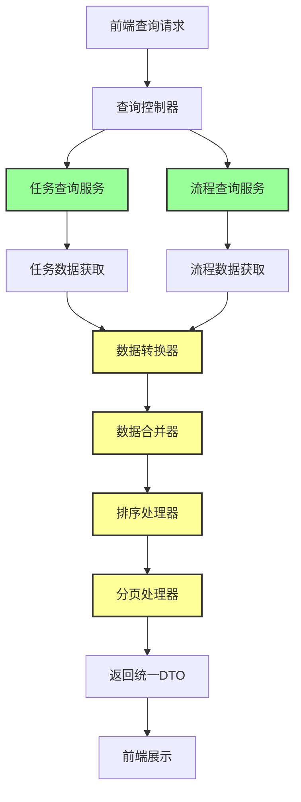

# 列表查询逻辑改造设计文档

## 1. 概述

本文档描述了工作台列表查询逻辑的改造方案，主要针对现有查询流程进行优化，将任务查询和流程查询进行整合，提供统一的查询接口和更高效的数据处理方式。

### 1.1 改造背景

当前系统中的任务查询和流程查询是分离的，存在以下问题：
- 查询逻辑分散，维护成本高
- 数据库分页查询效率低下
- 前端需要处理多种数据格式
- 缺乏统一的排序和分页机制

### 1.2 改造目标

- 去除原任务查询的数据库分页，改为内存分页
- 增加按流程查询逻辑，将流程查询结果转换成任务对应的DTO
- 将流程查询和任务查询内容合并
- 通过updateTime进行排序，最后分页并返回前端

## 2. 整体架构设计

### 2.1 架构概览



### 2.2 核心组件

1. **查询控制器**：接收前端请求，协调各查询服务
2. **任务查询服务**：处理原有任务查询逻辑
3. **流程查询服务**：新增的流程查询逻辑
4. **数据转换器**：将流程数据转换为任务DTO格式
5. **数据合并器**：合并任务和流程查询结果
6. **排序处理器**：按updateTime进行排序
7. **分页处理器**：内存分页处理

## 3. 详细设计

### 3.1 数据模型设计

#### 3.1.1 统一任务DTO

```java
public class UnifiedTaskDTO {
    private String id;              // 任务/流程ID
    private String businessId;      // 业务ID
    private String name;            // 任务/流程名称
    private String type;            // 类型：TASK/PROCESS
    private String status;          // 状态
    private String category;        // 分类
    private String assignee;        // 处理人
    private String orgId;           // 机构ID
    private String orgName;         // 机构名称
    private Date createTime;        // 创建时间
    private Date updateTime;        // 更新时间
    private String createUser;      // 创建人
    private String updateUser;      // 更新人
    private Map<String, Object> extendedProperties; // 扩展属性
    
    // getters and setters
}
```

#### 3.1.2 查询请求参数

```java
public class QueryRequest {
    private List<String> categories;    // 分类列表
    private List<String> statuses;      // 状态列表
    private List<String> orgIds;        // 机构ID列表
    private List<String> assignees;     // 处理人列表
    private Date startTime;             // 开始时间
    private Date endTime;               // 结束时间
    private String keyword;             // 关键词搜索
    private Integer pageNum;            // 页码
    private Integer pageSize;           // 页大小
    private String sortBy;              // 排序字段
    private String sortOrder;           // 排序方向
    
    // getters and setters
}
```

#### 3.1.3 查询响应结果

```java
public class QueryResponse<T> {
    private Long total;                 // 总记录数
    private Integer pageNum;            // 当前页码
    private Integer pageSize;           // 页大小
    private Integer totalPages;         // 总页数
    private List<T> records;            // 数据列表
    
    // getters and setters
}
```

### 3.2 查询服务设计

#### 3.2.1 任务查询服务

```java
@Service
public class TaskQueryService {
    
    /**
     * 查询任务数据（去除数据库分页）
     */
    public List<UnifiedTaskDTO> queryTasks(QueryRequest request) {
        // 1. 构建查询条件
        TaskQueryCondition condition = buildQueryCondition(request);
        
        // 2. 执行查询（不分页）
        List<TaskEntity> tasks = taskMapper.queryByCondition(condition);
        
        // 3. 转换为统一DTO
        return tasks.stream()
            .map(this::convertToUnifiedTaskDTO)
            .collect(Collectors.toList());
    }
    
    private UnifiedTaskDTO convertToUnifiedTaskDTO(TaskEntity task) {
        UnifiedTaskDTO dto = new UnifiedTaskDTO();
        dto.setId(task.getId());
        dto.setBusinessId(task.getBusinessId());
        dto.setName(task.getTaskName());
        dto.setType("TASK");
        dto.setStatus(task.getStatus());
        dto.setCategory(task.getCategory());
        dto.setAssignee(task.getAssignee());
        dto.setOrgId(task.getOrgId());
        dto.setOrgName(task.getOrgName());
        dto.setCreateTime(task.getCreateTime());
        dto.setUpdateTime(task.getUpdateTime());
        dto.setCreateUser(task.getCreateUser());
        dto.setUpdateUser(task.getUpdateUser());
        
        // 添加任务特有属性
        Map<String, Object> extended = new HashMap<>();
        extended.put("taskType", task.getTaskType());
        extended.put("priority", task.getPriority());
        dto.setExtendedProperties(extended);
        
        return dto;
    }
}
```

#### 3.2.2 流程查询服务

```java
@Service
public class ProcessQueryService {
    
    /**
     * 查询流程数据并转换为任务DTO格式
     */
    public List<UnifiedTaskDTO> queryProcesses(QueryRequest request) {
        // 1. 构建查询条件
        ProcessQueryCondition condition = buildQueryCondition(request);
        
        // 2. 执行流程查询
        List<ProcessEntity> processes = processMapper.queryByCondition(condition);
        
        // 3. 转换为统一任务DTO格式
        return processes.stream()
            .map(this::convertProcessToTaskDTO)
            .collect(Collectors.toList());
    }
    
    private UnifiedTaskDTO convertProcessToTaskDTO(ProcessEntity process) {
        UnifiedTaskDTO dto = new UnifiedTaskDTO();
        dto.setId(process.getId());
        dto.setBusinessId(process.getBusinessId());
        dto.setName(process.getProcessName());
        dto.setType("PROCESS");
        dto.setStatus(process.getStatus());
        dto.setCategory(process.getCategory());
        dto.setAssignee(process.getCurrentAssignee());
        dto.setOrgId(process.getOrgId());
        dto.setOrgName(process.getOrgName());
        dto.setCreateTime(process.getCreateTime());
        dto.setUpdateTime(process.getUpdateTime());
        dto.setCreateUser(process.getCreateUser());
        dto.setUpdateUser(process.getUpdateUser());
        
        // 添加流程特有属性
        Map<String, Object> extended = new HashMap<>();
        extended.put("processType", process.getProcessType());
        extended.put("currentTask", process.getCurrentTaskName());
        extended.put("totalTasks", process.getTotalTaskCount());
        extended.put("completedTasks", process.getCompletedTaskCount());
        dto.setExtendedProperties(extended);
        
        return dto;
    }
}
```

### 3.3 数据合并与处理

#### 3.3.1 数据合并器

```java
@Component
public class DataMerger {
    
    /**
     * 合并任务和流程数据
     */
    public List<UnifiedTaskDTO> mergeData(List<UnifiedTaskDTO> tasks, 
                                        List<UnifiedTaskDTO> processes) {
        List<UnifiedTaskDTO> result = new ArrayList<>();
        
        if (tasks != null) {
            result.addAll(tasks);
        }
        
        if (processes != null) {
            result.addAll(processes);
        }
        
        return result;
    }
    
    /**
     * 去重处理（基于ID）
     */
    public List<UnifiedTaskDTO> removeDuplicates(List<UnifiedTaskDTO> data) {
        return data.stream()
            .collect(Collectors.toMap(
                UnifiedTaskDTO::getId,
                Function.identity(),
                (existing, replacement) -> existing
            ))
            .values()
            .stream()
            .collect(Collectors.toList());
    }
}
```

#### 3.3.2 排序处理器

```java
@Component
public class SortProcessor {
    
    /**
     * 按updateTime排序
     */
    public List<UnifiedTaskDTO> sortByUpdateTime(List<UnifiedTaskDTO> data, 
                                               String sortOrder) {
        Comparator<UnifiedTaskDTO> comparator = Comparator
            .comparing(UnifiedTaskDTO::getUpdateTime);
        
        if ("desc".equalsIgnoreCase(sortOrder)) {
            comparator = comparator.reversed();
        }
        
        return data.stream()
            .sorted(comparator)
            .collect(Collectors.toList());
    }
    
    /**
     * 通用排序方法
     */
    public List<UnifiedTaskDTO> sort(List<UnifiedTaskDTO> data, 
                                   String sortBy, 
                                   String sortOrder) {
        if ("updateTime".equals(sortBy)) {
            return sortByUpdateTime(data, sortOrder);
        }
        // 可扩展其他排序字段
        return data;
    }
}
```

#### 3.3.3 分页处理器

```java
@Component
public class PaginationProcessor {
    
    /**
     * 内存分页处理
     */
    public <T> QueryResponse<T> paginate(List<T> data, 
                                       Integer pageNum, 
                                       Integer pageSize) {
        QueryResponse<T> response = new QueryResponse<>();
        
        // 设置总数
        response.setTotal((long) data.size());
        response.setPageSize(pageSize);
        
        // 计算总页数
        int totalPages = (int) Math.ceil((double) data.size() / pageSize);
        response.setTotalPages(totalPages);
        response.setPageNum(pageNum);
        
        // 计算分页范围
        int startIndex = (pageNum - 1) * pageSize;
        int endIndex = Math.min(startIndex + pageSize, data.size());
        
        // 获取分页数据
        List<T> pageData = new ArrayList<>();
        if (startIndex < data.size()) {
            pageData = data.subList(startIndex, endIndex);
        }
        
        response.setRecords(pageData);
        return response;
    }
}
```

### 3.4 控制器设计

```java
@RestController
@RequestMapping("/api/v1/workbench")
public class WorkbenchQueryController {
    
    @Autowired
    private TaskQueryService taskQueryService;
    
    @Autowired
    private ProcessQueryService processQueryService;
    
    @Autowired
    private DataMerger dataMerger;
    
    @Autowired
    private SortProcessor sortProcessor;
    
    @Autowired
    private PaginationProcessor paginationProcessor;
    
    /**
     * 统一查询接口
     */
    @PostMapping("/query")
    public QueryResponse<UnifiedTaskDTO> query(@RequestBody QueryRequest request) {
        // 1. 参数校验
        validateRequest(request);
        
        // 2. 并行查询任务和流程数据
        CompletableFuture<List<UnifiedTaskDTO>> tasksFuture = 
            CompletableFuture.supplyAsync(() -> taskQueryService.queryTasks(request));
            
        CompletableFuture<List<UnifiedTaskDTO>> processesFuture = 
            CompletableFuture.supplyAsync(() -> processQueryService.queryProcesses(request));
        
        // 3. 等待查询完成
        List<UnifiedTaskDTO> tasks = tasksFuture.join();
        List<UnifiedTaskDTO> processes = processesFuture.join();
        
        // 4. 合并数据
        List<UnifiedTaskDTO> mergedData = dataMerger.mergeData(tasks, processes);
        
        // 5. 去重处理
        List<UnifiedTaskDTO> uniqueData = dataMerger.removeDuplicates(mergedData);
        
        // 6. 排序处理（默认按updateTime降序）
        String sortBy = StringUtils.hasText(request.getSortBy()) ? 
            request.getSortBy() : "updateTime";
        String sortOrder = StringUtils.hasText(request.getSortOrder()) ? 
            request.getSortOrder() : "desc";
        List<UnifiedTaskDTO> sortedData = sortProcessor.sort(uniqueData, sortBy, sortOrder);
        
        // 7. 分页处理
        Integer pageNum = request.getPageNum() != null ? request.getPageNum() : 1;
        Integer pageSize = request.getPageSize() != null ? request.getPageSize() : 20;
        
        return paginationProcessor.paginate(sortedData, pageNum, pageSize);
    }
    
    private void validateRequest(QueryRequest request) {
        if (request.getPageNum() == null || request.getPageNum() < 1) {
            throw new IllegalArgumentException("页码必须大于0");
        }
        if (request.getPageSize() == null || request.getPageSize() < 1 || request.getPageSize() > 100) {
            throw new IllegalArgumentException("页大小必须在1-100之间");
        }
    }
}
```

## 4. 数据库设计

### 4.1 任务表结构优化

```sql
-- 任务实例表
CREATE TABLE TASK_INSTANCE (
    id VARCHAR(64) PRIMARY KEY,
    business_id VARCHAR(64) NOT NULL,
    task_name VARCHAR(200) NOT NULL,
    task_type VARCHAR(50) NOT NULL,
    category VARCHAR(50) NOT NULL,
    status VARCHAR(20) NOT NULL,
    assignee VARCHAR(64),
    org_id VARCHAR(64) NOT NULL,
    org_name VARCHAR(200),
    priority INTEGER DEFAULT 0,
    create_time DATETIME NOT NULL,
    create_user VARCHAR(64) NOT NULL,
    update_time DATETIME NOT NULL,
    update_user VARCHAR(64),
    INDEX idx_category_status (category, status),
    INDEX idx_org_update_time (org_id, update_time),
    INDEX idx_assignee_status (assignee, status),
    INDEX idx_business_id (business_id)
);
```

### 4.2 流程表结构优化

```sql
-- 流程实例表
CREATE TABLE PROCESS_INSTANCE (
    id VARCHAR(64) PRIMARY KEY,
    business_id VARCHAR(64) NOT NULL,
    process_name VARCHAR(200) NOT NULL,
    process_type VARCHAR(50) NOT NULL,
    category VARCHAR(50) NOT NULL,
    status VARCHAR(20) NOT NULL,
    current_assignee VARCHAR(64),
    current_task_name VARCHAR(200),
    total_task_count INTEGER DEFAULT 0,
    completed_task_count INTEGER DEFAULT 0,
    org_id VARCHAR(64) NOT NULL,
    org_name VARCHAR(200),
    create_time DATETIME NOT NULL,
    create_user VARCHAR(64) NOT NULL,
    update_time DATETIME NOT NULL,
    update_user VARCHAR(64),
    INDEX idx_category_status (category, status),
    INDEX idx_org_update_time (org_id, update_time),
    INDEX idx_current_assignee (current_assignee, status),
    INDEX idx_business_id (business_id)
);
```

## 5. 性能优化

### 5.1 查询优化

1. **并行查询**：任务查询和流程查询并行执行，减少总查询时间
2. **索引优化**：为常用查询字段创建复合索引
3. **批量查询**：避免N+1查询问题，使用批量查询获取关联数据
4. **缓存策略**：对热点数据使用缓存，减少数据库访问

### 5.2 内存优化

1. **流式处理**：使用Stream API进行数据处理，减少内存占用
2. **分页优化**：内存分页前先进行排序和过滤，减少处理数据量
3. **对象复用**：复用DTO对象，减少对象创建和GC压力

## 6. 异常处理

### 6.1 异常类型定义

```java
public enum QueryErrorCode {
    INVALID_PARAMETER("Q001", "查询参数无效"),
    DATA_ACCESS_ERROR("Q002", "数据访问异常"),
    TIMEOUT_ERROR("Q003", "查询超时"),
    PERMISSION_DENIED("Q004", "查询权限不足");
    
    private String code;
    private String message;
    
    // constructor and getters
}
```

### 6.2 全局异常处理

```java
@RestControllerAdvice
public class QueryExceptionHandler {
    
    @ExceptionHandler(IllegalArgumentException.class)
    public ResponseEntity<ErrorResponse> handleIllegalArgument(IllegalArgumentException e) {
        ErrorResponse error = new ErrorResponse(
            QueryErrorCode.INVALID_PARAMETER.getCode(),
            e.getMessage()
        );
        return ResponseEntity.badRequest().body(error);
    }
    
    @ExceptionHandler(DataAccessException.class)
    public ResponseEntity<ErrorResponse> handleDataAccess(DataAccessException e) {
        ErrorResponse error = new ErrorResponse(
            QueryErrorCode.DATA_ACCESS_ERROR.getCode(),
            "数据查询异常，请稍后重试"
        );
        return ResponseEntity.status(HttpStatus.INTERNAL_SERVER_ERROR).body(error);
    }
    
    @ExceptionHandler(TimeoutException.class)
    public ResponseEntity<ErrorResponse> handleTimeout(TimeoutException e) {
        ErrorResponse error = new ErrorResponse(
            QueryErrorCode.TIMEOUT_ERROR.getCode(),
            "查询超时，请缩小查询范围后重试"
        );
        return ResponseEntity.status(HttpStatus.REQUEST_TIMEOUT).body(error);
    }
}
```

## 7. 监控与日志

### 7.1 性能监控

```java
@Component
public class QueryMonitor {
    
    private final MeterRegistry meterRegistry;
    
    public QueryMonitor(MeterRegistry meterRegistry) {
        this.meterRegistry = meterRegistry;
    }
    
    public <T> T monitorQuery(String queryName, Supplier<T> querySupplier) {
        return Timer.Sample.start(meterRegistry)
            .stop(meterRegistry.timer("workbench.query", "name", queryName))
            .recordCallable(() -> {
                Counter.builder("workbench.query.count")
                    .tag("name", queryName)
                    .register(meterRegistry)
                    .increment();
                return querySupplier.get();
            });
    }
}
```

### 7.2 查询日志

```java
@Slf4j
@Component
public class QueryLogger {
    
    public void logQueryStart(String queryId, QueryRequest request) {
        log.info("查询开始 - ID: {}, 请求参数: {}", queryId, request);
    }
    
    public void logQueryEnd(String queryId, long duration, int resultCount) {
        log.info("查询完成 - ID: {}, 耗时: {}ms, 结果数量: {}", queryId, duration, resultCount);
    }
    
    public void logQueryError(String queryId, Exception e) {
        log.error("查询异常 - ID: {}, 异常信息: {}", queryId, e.getMessage(), e);
    }
}
```

## 8. 测试策略

### 8.1 单元测试

```java
@ExtendWith(MockitoExtension.class)
class WorkbenchQueryControllerTest {
    
    @Mock
    private TaskQueryService taskQueryService;
    
    @Mock
    private ProcessQueryService processQueryService;
    
    @Mock
    private DataMerger dataMerger;
    
    @InjectMocks
    private WorkbenchQueryController controller;
    
    @Test
    void testQuerySuccess() {
        // Given
        QueryRequest request = new QueryRequest();
        request.setPageNum(1);
        request.setPageSize(10);
        
        List<UnifiedTaskDTO> tasks = Arrays.asList(new UnifiedTaskDTO());
        List<UnifiedTaskDTO> processes = Arrays.asList(new UnifiedTaskDTO());
        
        when(taskQueryService.queryTasks(any())).thenReturn(tasks);
        when(processQueryService.queryProcesses(any())).thenReturn(processes);
        when(dataMerger.mergeData(any(), any())).thenReturn(Arrays.asList(new UnifiedTaskDTO()));
        
        // When
        QueryResponse<UnifiedTaskDTO> response = controller.query(request);
        
        // Then
        assertThat(response).isNotNull();
        assertThat(response.getTotal()).isEqualTo(1);
    }
}
```

### 8.2 集成测试

```java
@SpringBootTest
@TestPropertySource(locations = "classpath:application-test.properties")
class WorkbenchQueryIntegrationTest {
    
    @Autowired
    private WorkbenchQueryController controller;
    
    @Test
    @Transactional
    void testQueryWithRealData() {
        // 准备测试数据
        prepareTestData();
        
        // 执行查询
        QueryRequest request = new QueryRequest();
        request.setCategories(Arrays.asList("每日流程", "参数规则"));
        request.setPageNum(1);
        request.setPageSize(20);
        
        QueryResponse<UnifiedTaskDTO> response = controller.query(request);
        
        // 验证结果
        assertThat(response.getRecords()).isNotEmpty();
        assertThat(response.getTotal()).isGreaterThan(0);
    }
}
```

## 9. 部署与配置

### 9.1 配置参数

```yaml
# application.yml
workbench:
  query:
    # 默认页大小
    default-page-size: 20
    # 最大页大小
    max-page-size: 100
    # 查询超时时间（毫秒）
    query-timeout: 30000
    # 是否启用查询缓存
    enable-cache: true
    # 缓存过期时间（秒）
    cache-expire-time: 300
    # 并行查询线程池大小
    parallel-query-thread-pool-size: 10
```

### 9.2 配置类

```java
@ConfigurationProperties(prefix = "workbench.query")
@Component
public class QueryConfig {
    private int defaultPageSize = 20;
    private int maxPageSize = 100;
    private long queryTimeout = 30000;
    private boolean enableCache = true;
    private long cacheExpireTime = 300;
    private int parallelQueryThreadPoolSize = 10;
    
    // getters and setters
}
```

## 10. 总结

本文档详细描述了工作台列表查询逻辑的改造方案，主要实现了以下目标：

1. **去除数据库分页**：改为内存分页，提高查询效率
2. **增加流程查询**：新增流程查询逻辑，将流程数据转换为任务DTO格式
3. **数据合并**：统一任务和流程查询结果，提供一致的数据格式
4. **排序分页**：按updateTime排序后进行内存分页，返回统一格式数据

通过这次改造，系统将具有以下优势：

- **查询效率提升**：并行查询和内存分页提高了查询性能
- **数据格式统一**：前端只需处理一种数据格式，降低开发复杂度
- **维护成本降低**：统一的查询逻辑减少了代码重复和维护成本
- **扩展性增强**：易于添加新的查询类型和排序字段

该方案在保证功能完整性的同时，提供了良好的性能和可维护性，为系统的长期发展奠定了基础。