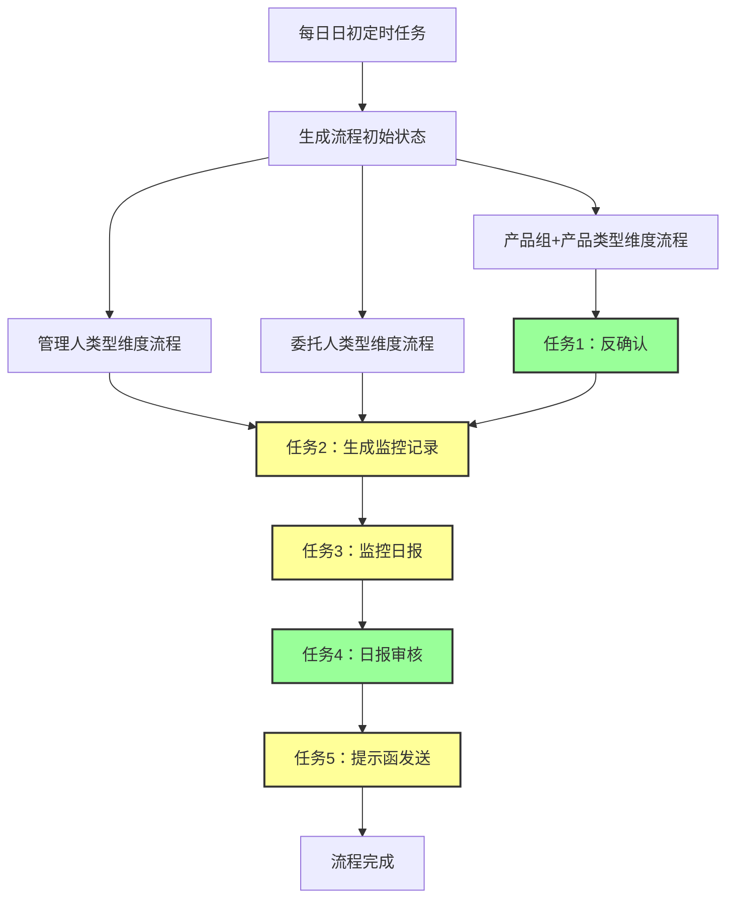
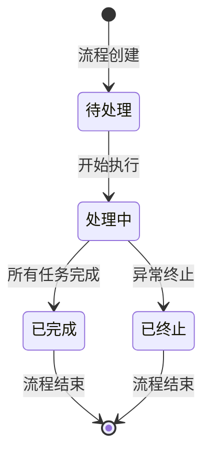
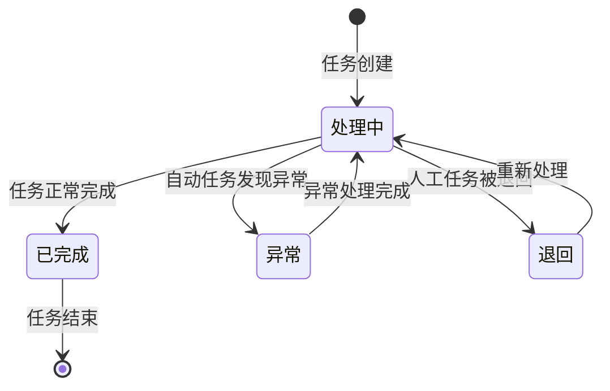

# 每日业务流程

## 概述

每日业务流程是系统日常运行的核心流程，通过自动化和人工操作相结合的方式，完成对业务数据的监控、审核和通知工作。流程按三个独立维度（产品组+产品类型、管理人类型、委托人类型）分别生成，其中产品组+产品类型维度包含五个串行执行的任务环节，管理人类型和委托人类型维度包含四个串行执行的任务环节（无需反确认任务）。

## 流程架构

## 流程初始化

### 日初定时生成流程初始状态

#### 触发条件
- **触发时间**：每日日初（系统配置的固定时间点）
- **触发方式**：系统定时任务自动触发

#### 生成维度
系统根据以下三个独立维度分别生成流程：
1. **产品组+产品类型维度**：按产品组和产品类型组合分别生成流程
2. **管理人类型维度**：按不同管理人类型分别生成流程
3. **委托人类型维度**：按不同委托人类型分别生成流程

#### 初始化流程
1. 系统检查各维度下的业务数据
2. 为每个维度创建独立的流程实例
3. 设置流程初始状态为"待处理"
4. 根据维度类型创建第一个任务节点：
   - 产品组+产品类型维度：创建"反确认"任务节点，并设置为"处理中"状态
   - 管理人类型和委托人类型维度：创建"生成监控记录"任务节点，并设置为"处理中"状态
5. 记录流程创建时间和创建人

#### 流程状态
- **待处理**：流程已创建，但尚未开始处理
- **处理中**：流程正在执行中
- **已完成**：流程所有任务已完成
- **已终止**：流程因异常情况被终止

## 任务环节详解

### 任务1：反确认

#### 任务描述
反确认是产品组+产品类型维度流程的第一个环节，主要用于验证业务数据的准确性和完整性。管理人类型和委托人类型维度无需执行此任务。

#### 适用维度
- **产品组+产品类型维度**：需要执行反确认任务
- **管理人类型维度**：无需执行反确认任务
- **委托人类型维度**：无需执行反确认任务

#### 执行方式
- **执行类型**：自动执行
- **跳转方式**：任务处理完成后自动跳转到下一环节

#### 处理逻辑
1. 系统自动检查业务数据的完整性和准确性
2. 验证数据是否符合预设规则和标准
3. 如发现问题，标记异常并记录原因
4. 完成验证后，自动将任务状态更新为"已完成"
5. 自动创建下一任务"生成监控记录"，并设置为"处理中"状态

#### 任务状态
- **处理中**：任务正在执行中
- **已完成**：任务已完成，数据验证通过
- **异常**：发现数据异常，需要人工干预

### 任务2：生成监控记录

#### 任务描述
生成监控记录是流程中的重要环节，用于后续的监控和日报生成。在产品组+产品类型维度中，此任务根据反确认结果生成监控记录；在管理人类型和委托人类型维度中，此任务是流程的第一个环节。

#### 适用维度
- **产品组+产品类型维度**：需要执行生成监控记录任务（根据反确认结果）
- **管理人类型维度**：需要执行生成监控记录任务（作为第一个任务）
- **委托人类型维度**：需要执行生成监控记录任务（作为第一个任务）

#### 执行方式
- **执行类型**：人工操作
- **跳转方式**：人工确认完成后进入下一环节

#### 处理逻辑
1. **产品组+产品类型维度**：
   - 人工查看反确认结果和异常数据
   - 根据业务规则生成监控记录
   - 对异常数据进行处理和标记
2. **管理人类型和委托人类型维度**：
   - 人工查看业务数据
   - 根据业务规则生成监控记录
   - 对异常数据进行处理和标记
3. 确认监控记录无误后，手动完成任务
4. 系统创建下一任务"监控日报"，并设置为"处理中"状态

#### 任务状态
- **处理中**：任务正在处理中
- **已完成**：监控记录已生成并确认
- **退回**：监控记录需要重新生成

### 任务3：监控日报

#### 任务描述
基于生成的监控记录，创建监控日报，汇总当日监控情况。

#### 执行方式
- **执行类型**：人工操作
- **跳转方式**：人工确认完成后进入下一环节

#### 处理逻辑
1. 人工查看监控记录和异常情况
2. 根据监控记录生成监控日报
3. 汇总当日监控数据和异常情况
4. 确认日报内容无误后，手动完成任务
5. 系统创建下一任务"日报审核"，并设置为"处理中"状态

#### 任务状态
- **处理中**：任务正在处理中
- **已完成**：监控日报已生成并确认
- **退回**：监控日报需要重新生成

### 任务4：日报审核

#### 任务描述
对生成的监控日报进行审核，确保日报内容的准确性和完整性。

#### 执行方式
- **执行类型**：自动执行
- **跳转方式**：任务处理完成后自动跳转到下一环节

#### 处理逻辑
1. 系统自动检查监控日报的完整性和准确性
2. 验证日报数据是否符合业务规则和标准
3. 如发现问题，标记异常并记录原因
4. 完成审核后，自动将任务状态更新为"已完成"
5. 自动创建下一任务"提示函发送"，并设置为"处理中"状态

#### 任务状态
- **处理中**：任务正在执行中
- **已完成**：日报审核通过
- **异常**：发现日报异常，需要人工干预

### 任务5：提示函发送

#### 任务描述
根据监控日报和审核结果，生成并发送相应的提示函。

#### 执行方式
- **执行类型**：人工操作
- **跳转方式**：人工确认完成后流程结束

#### 处理逻辑
1. 人工查看监控日报和审核结果
2. 根据业务规则生成提示函
3. 确认提示函内容无误后，发送提示函
4. 记录发送结果和接收方信息
5. 手动完成任务，流程状态更新为"已完成"

#### 任务状态
- **处理中**：任务正在处理中
- **已完成**：提示函已发送
- **退回**：提示函需要重新生成

## 自动执行与人工操作任务区别

### 自动执行任务
自动执行任务由系统自动完成，无需人工干预，主要包括：

1. **反确认**（仅适用于产品组+产品类型维度）
   - 系统自动验证数据完整性和准确性
   - 完成后自动跳转到下一环节
   - 主要用于数据预处理和验证

2. **日报审核**
   - 系统自动检查日报的完整性和准确性
   - 完成后自动跳转到下一环节
   - 主要用于质量控制和合规检查

### 人工操作任务
人工操作任务需要业务人员手动完成，主要包括：

1. **生成监控记录**
   - 产品组+产品类型维度：需要人工查看反确认结果
   - 管理人类型和委托人类型维度：作为第一个任务，需要人工查看业务数据
   - 根据业务判断生成监控记录
   - 人工确认后进入下一环节

2. **监控日报**
   - 需要人工汇总监控数据
   - 根据业务规则生成日报
   - 人工确认后进入下一环节

3. **提示函发送**
   - 需要人工生成提示函内容
   - 确认发送对象和内容
   - 人工发送后完成整个流程

## 流程状态转换

### 流程状态转换图

### 任务状态转换图

## 异常处理

### 自动任务异常处理
1. 系统发现异常时，将任务状态标记为"异常"
2. 记录异常原因和时间
3. 通知相关处理人员
4. 处理人员修复异常后，将任务状态恢复为"处理中"
5. 系统重新执行任务

### 人工任务退回处理
1. 处理人员发现问题时，可将任务退回
2. 记录退回原因和时间
3. 任务状态更新为"退回"
4. 重新分配给原处理人或指定新处理人
5. 处理人员重新处理任务

## 权限控制

### 流程创建权限
- 系统管理员：可创建所有维度的流程
- 产品管理员：可创建产品组+产品类型维度的流程
- 管理人管理员：可创建管理人类型维度的流程
- 委托人管理员：可创建委托人类型维度的流程

### 任务处理权限
- 反确认（仅产品组+产品类型维度）：系统自动执行，无需特殊权限
- 生成监控记录：需要监控记录生成权限
- 监控日报：需要日报生成权限
- 日报审核：系统自动执行，无需特殊权限
- 提示函发送：需要提示函发送权限

## 日志记录

### 流程日志
系统记录每个流程的完整生命周期，包括：
- 流程创建时间和创建人
- 流程状态变更时间和操作人
- 流程完成时间和结果
- 流程异常情况和处理记录

### 任务日志
系统记录每个任务的执行情况，包括：
- 任务创建时间和创建人
- 任务状态变更时间和操作人
- 任务处理时间和处理人
- 任务异常情况和处理记录
- 任务退回原因和处理记录

## 总结

每日业务流程通过自动化和人工操作相结合的方式，确保业务数据的准确性、完整性和及时性。流程按四个独立维度分别生成，其中：

- **产品组+产品类型维度**：包含五个串行执行的任务环节（反确认、生成监控记录、监控日报、日报审核、提示函发送）
- **管理人类型和委托人类型维度**：包含四个串行执行的任务环节（生成监控记录、监控日报、日报审核、提示函发送），无需反确认任务

自动执行任务包括反确认（仅适用于产品组+产品类型维度）和日报审核；人工操作任务包括生成监控记录、监控日报和提示函发送。通过严格的流程控制和权限管理，确保业务流程的规范性和安全性。