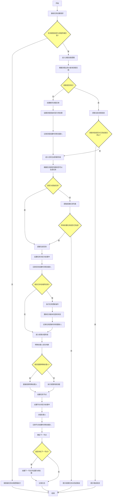
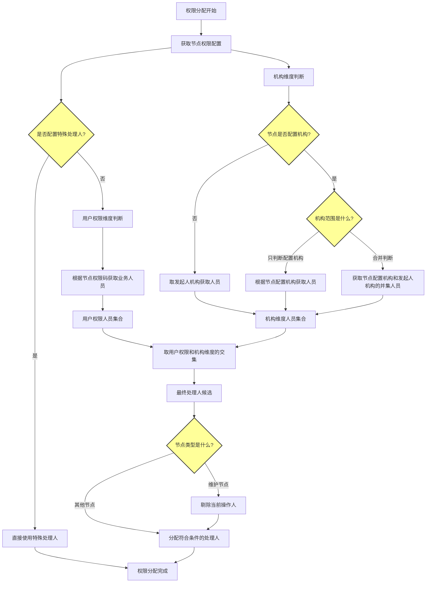
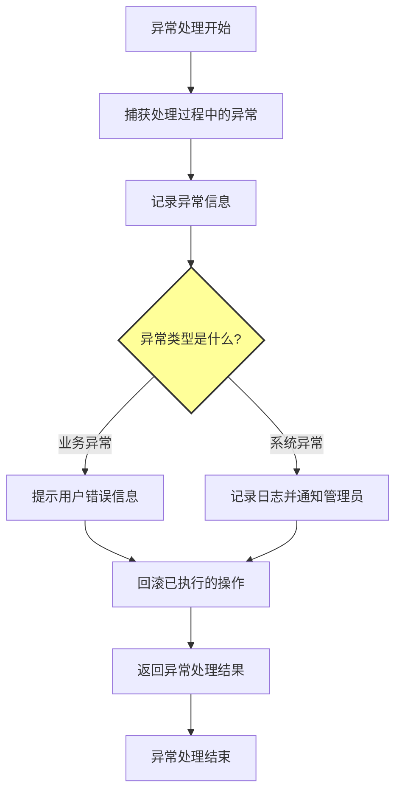
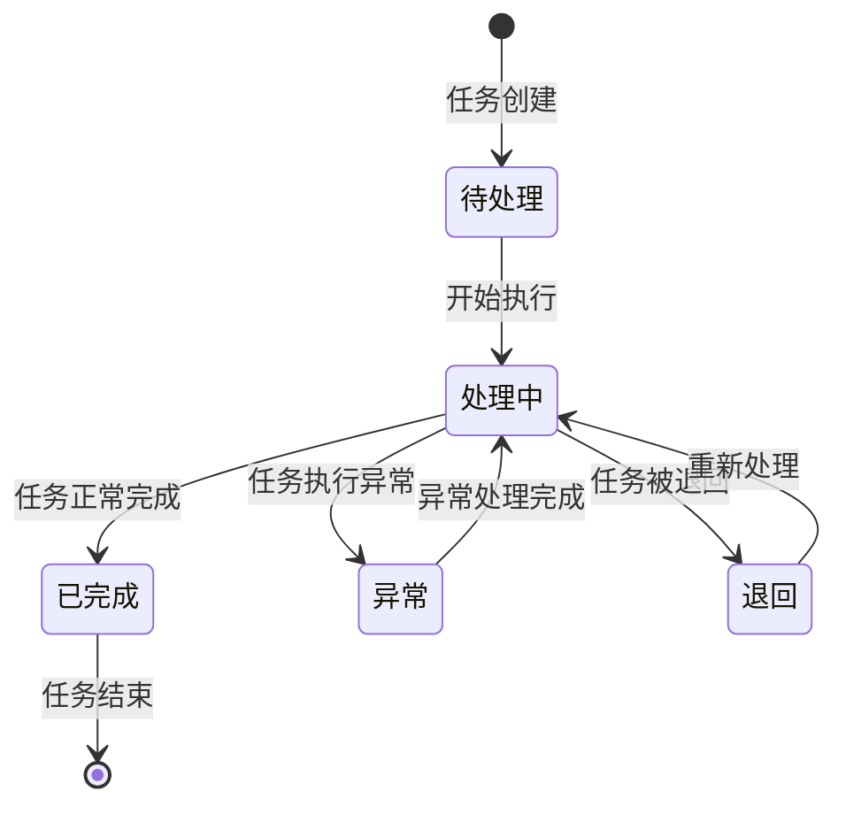

# 流程任务创建业务流程

## 1. 概述

流程任务创建是指在业务系统中，根据特定的业务规则和流程配置，自动或手动创建流程任务的过程。该流程主要处理任务新增时的业务逻辑判断，确保任务能够按照预定的流程规则正确创建和执行。

### 1.1 业务背景

在复杂的业务系统中，许多任务需要按照特定的流程顺序执行。流程任务创建功能确保了任务能够按照业务规则和流程配置正确创建，并满足前置任务完成的要求，从而保证业务流程的顺畅执行。

### 1.2 核心目标

- 确保任务按照业务规则和流程配置正确创建
- 验证前置任务的完成状态
- 支持流程的动态创建和管理
- 提供灵活的权限分配机制
- 记录完整的操作日志

### 1.3 适用范围

本流程适用于所有需要按照特定流程规则创建任务的业务场景，特别是：
- 任务类型为流程所属任务（任务所属的流程类型为实体类型）的场景
- 需要验证前置任务完成状态的场景
- 需要动态创建流程实体的场景

## 2. 流程架构

### 2.1 整体架构

流程任务创建包含以下主要阶段：

1. **任务类型判断阶段**：判断任务是否为流程所属任务
2. **流程处理阶段**：处理流程的创建或获取
3. **任务生成判断阶段**：判断是否可以生成任务
4. **任务更新逻辑阶段**：处理已存在任务的更新
5. **权限分配阶段**：为任务分配处理人
6. **任务节点创建阶段**：创建任务节点并设置状态
7. **日志记录阶段**：记录操作日志
8. **异常处理阶段**：处理执行过程中的异常

### 2.2 流程架构图



## 3. 详细流程说明

### 3.1 任务类型判断阶段

#### 3.1.1 输入参数

- 任务基本信息（任务ID、任务名称、任务类型等）
- 流程业务ID
- 任务所属的流程类型

#### 3.1.2 处理逻辑

1. 接收任务创建请求，验证输入参数的完整性和有效性
2. 判断任务类型是否为流程所属任务（任务所属的流程类型为实体类型）
   - 如果是流程所属任务，进入流程处理逻辑
   - 如果不是流程所属任务，按照普通任务处理逻辑执行

#### 3.1.3 输出结果

- 流程所属任务：进入流程处理阶段
- 非流程所属任务：按普通任务处理逻辑执行

### 3.2 流程处理阶段

#### 3.2.1 输入参数

- 流程业务ID
- 流程类型

#### 3.2.2 处理逻辑

1. 根据流程业务ID查询流程实例
   - 查询条件：流程业务ID + 流程类型
2. 判断流程是否存在
   - **流程不存在**：
     * 创建新的流程实体
     * 设置流程初始状态为"待处理"
     * 记录流程创建时间和创建人
     * 返回新创建的流程信息
   - **流程存在**：
     * 获取当前流程信息
     * 检查流程状态（待处理、处理中、已完成、已终止）
     * 如果流程状态为"已完成"或"已终止"，提示错误信息："流程已结束，无法创建新任务"
     * 返回现有流程信息

#### 3.2.3 输出结果

- 流程不存在：返回新创建的流程信息
- 流程存在且状态正常：返回现有流程信息
- 流程存在但状态异常：返回错误信息

### 3.3 任务生成判断阶段

#### 3.3.1 输入参数

- 任务类型
- 流程信息
- 任务配置信息

#### 3.3.2 处理逻辑

1. 根据传入的任务类型判断当前是否可以生成任务
2. 判断是否为初始任务
   - **是初始任务**：
     * 直接生成任务
     * 设置任务状态为"处理中"
     * 记录任务创建时间和创建人
     * 返回任务创建成功信息
   - **不是初始任务**：
     * 根据流程配置顺序获取任务的前置任务列表
     * 检查所有前置任务是否已完成
     - **所有前置任务已完成**：
       + 生成当前任务
       + 设置任务状态为"处理中"
       + 记录任务创建时间和创建人
       + 返回任务创建成功信息
     - **存在未完成的前置任务**：
       + 不生成任务
       + 提示错误信息："前置任务未完成，无法生成当前任务"
       + 返回任务创建失败信息

#### 3.3.3 输出结果

- 初始任务或前置任务已完成：返回任务创建成功信息
- 前置任务未完成：返回任务创建失败信息

### 3.4 任务更新逻辑阶段

#### 3.4.1 输入参数

- 任务ID
- 任务更新信息
- 流程信息

#### 3.4.2 处理逻辑

1. 检查是否已存在相同的任务
   - 查询条件：业务ID + 任务类型
2. **存在相同任务**：
   - 执行任务更新操作
   - 更新任务基本信息
   - 更新任务状态
   - 记录任务更新时间和更新人
   - 返回任务更新成功信息
3. **不存在相同任务**：
   - 按照新任务创建逻辑处理
   - 返回任务创建成功信息

#### 3.4.3 输出结果

- 存在相同任务：返回任务更新成功信息
- 不存在相同任务：返回任务创建成功信息

### 3.5 权限分配阶段

#### 3.5.1 输入参数

- 任务信息
- 流程信息
- 当前操作人信息

#### 3.5.2 处理逻辑

1. 根据任务类型和流程配置确定权限分配规则
2. 特殊处理人优先判断
   - 如果节点配置了特殊处理人，直接使用特殊处理人
   - 跳过后续权限判断流程
3. 无特殊处理人时的权限判断
   - 用户权限维度：根据节点权限码获取有权限的业务人员
   - 机构维度：根据节点配置获取机构人员
   - 取用户权限维度和机构维度的交集作为最终处理人候选
4. 分配符合条件的处理人
5. 记录权限分配信息

#### 3.5.3 权限分配流程图



#### 3.5.4 输出结果

- 成功分配处理人：返回处理人信息
- 分配失败：返回错误信息

### 3.6 任务节点创建阶段

#### 3.6.1 输入参数

- 任务信息
- 处理人信息
- 流程信息

#### 3.6.2 处理逻辑

1. 创建任务节点
2. 设置节点状态为"处理中"
3. 分配处理人
4. 记录节点创建时间和创建人
5. 根据流程配置确定下一节点
6. 如果存在下一节点，创建下一节点并设置为"待处理"
7. 记录节点关系

#### 3.6.3 输出结果

- 任务节点创建成功：返回节点信息
- 任务节点创建失败：返回错误信息

### 3.7 日志记录阶段

#### 3.7.1 输入参数

- 任务信息
- 流程信息
- 操作信息

#### 3.7.2 处理逻辑

1. 记录流程日志
   - 流程创建/更新日志
   - 流程状态变更日志
2. 记录任务日志
   - 任务创建/更新日志
   - 任务状态变更日志
   - 任务处理日志
3. 记录操作日志
   - 操作人信息
   - 操作时间
   - 操作类型
   - 操作结果

#### 3.7.3 输出结果

- 日志记录成功：返回日志记录信息
- 日志记录失败：返回错误信息

### 3.8 异常处理阶段

#### 3.8.1 输入参数

- 异常信息
- 任务信息
- 流程信息

#### 3.8.2 处理逻辑

1. 捕获处理过程中的异常
2. 记录异常信息
   - 异常类型
   - 异常原因
   - 异常时间
   - 异常位置
3. 根据异常类型进行相应处理
   - 业务异常：提示用户错误信息
   - 系统异常：记录日志并通知管理员
4. 回滚已执行的操作
5. 返回异常处理结果

#### 3.8.3 异常处理流程图



#### 3.8.4 输出结果

- 异常处理成功：返回异常处理结果
- 异常处理失败：返回错误信息

## 4. 状态管理

### 4.1 流程状态

流程包含以下状态：

1. **待处理**：流程已创建，但尚未开始处理
2. **处理中**：流程正在执行中
3. **已完成**：流程所有任务已完成
4. **已终止**：流程因异常情况被终止

### 4.2 任务状态

任务包含以下状态：

1. **待处理**：任务已创建，但尚未开始处理
2. **处理中**：任务正在执行中
3. **已完成**：任务执行完成
4. **异常**：任务执行过程中出现异常
5. **退回**：任务被退回重新处理

### 4.3 节点状态

节点包含以下状态：

1. **处理中**：节点正在执行中
2. **已完成**：节点执行完成
3. **已通过**：节点审核通过
4. **已退回**：节点被退回
5. **已废弃**：节点被废弃
6. **已删除**：节点被删除

### 4.4 状态转换图



## 5. 数据模型

### 5.1 流程实体

| 字段名 | 类型 | 描述 |
|--------|------|------|
| id | String | 流程ID |
| businessId | String | 流程业务ID |
| processType | String | 流程类型 |
| status | String | 流程状态 |
| createTime | Date | 创建时间 |
| createUser | String | 创建人 |
| updateTime | Date | 更新时间 |
| updateUser | String | 更新人 |

### 5.2 任务实体

| 字段名 | 类型 | 描述 |
|--------|------|------|
| id | String | 任务ID |
| businessId | String | 业务ID |
| taskType | String | 任务类型 |
| processId | String | 流程ID |
| status | String | 任务状态 |
| createTime | Date | 创建时间 |
| createUser | String | 创建人 |
| updateTime | Date | 更新时间 |
| updateUser | String | 更新人 |

### 5.3 任务节点实体

| 字段名 | 类型 | 描述 |
|--------|------|------|
| id | String | 节点ID |
| taskId | String | 任务ID |
| nodeType | String | 节点类型 |
| status | String | 节点状态 |
| handler | String | 处理人 |
| createTime | Date | 创建时间 |
| createUser | String | 创建人 |
| updateTime | Date | 更新时间 |
| updateUser | String | 更新人 |

## 6. 接口设计

### 6.1 创建流程任务接口

#### 6.1.1 接口定义

```
POST /api/process/task/create
```

#### 6.1.2 请求参数

```json
{
  "businessId": "业务ID",
  "taskType": "任务类型",
  "processType": "流程类型",
  "taskInfo": {
    "taskName": "任务名称",
    "taskDesc": "任务描述",
    "priority": "优先级"
  },
  "operator": "操作人"
}
```

#### 6.1.3 响应结果

```json
{
  "code": "200",
  "message": "操作成功",
  "data": {
    "taskId": "任务ID",
    "processId": "流程ID",
    "status": "处理中",
    "nodes": [
      {
        "nodeId": "节点ID",
        "nodeType": "节点类型",
        "status": "处理中",
        "handler": "处理人"
      }
    ]
  }
}
```

### 6.2 查询流程任务接口

#### 6.2.1 接口定义

```
GET /api/process/task/query
```

#### 6.2.2 请求参数

| 参数名 | 类型 | 必填 | 描述 |
|--------|------|------|------|
| businessId | String | 是 | 业务ID |
| taskType | String | 是 | 任务类型 |

#### 6.2.3 响应结果

```json
{
  "code": "200",
  "message": "查询成功",
  "data": {
    "taskId": "任务ID",
    "businessId": "业务ID",
    "taskType": "任务类型",
    "processId": "流程ID",
    "status": "任务状态",
    "nodes": [
      {
        "nodeId": "节点ID",
        "nodeType": "节点类型",
        "status": "节点状态",
        "handler": "处理人"
      }
    ]
  }
}
```

## 7. 异常处理

### 7.1 业务异常

| 异常码 | 异常信息 | 处理方式 |
|--------|----------|----------|
| PROCESS_NOT_EXIST | 流程不存在 | 创建新流程 |
| PROCESS_COMPLETED | 流程已完成 | 提示错误信息 |
| PROCESS_TERMINATED | 流程已终止 | 提示错误信息 |
| PRETASK_NOT_COMPLETED | 前置任务未完成 | 提示错误信息 |
| TASK_ALREADY_EXIST | 任务已存在 | 更新任务信息 |
| NO_PERMISSION | 无权限操作 | 提示错误信息 |

### 7.2 系统异常

| 异常码 | 异常信息 | 处理方式 |
|--------|----------|----------|
| SYSTEM_ERROR | 系统错误 | 记录日志并通知管理员 |
| DATABASE_ERROR | 数据库错误 | 记录日志并通知管理员 |
| NETWORK_ERROR | 网络错误 | 记录日志并重试 |
| TIMEOUT_ERROR | 超时错误 | 记录日志并重试 |

## 8. 日志记录

### 8.1 流程日志

系统记录流程的完整生命周期，包括：

- 流程创建时间和创建人
- 流程状态变更时间和操作人
- 流程完成时间和结果
- 流程异常情况和处理记录

### 8.2 任务日志

系统记录任务的执行情况，包括：

- 任务创建时间和创建人
- 任务状态变更时间和操作人
- 任务处理时间和处理人
- 任务异常情况和处理记录
- 任务退回原因和处理记录

### 8.3 操作日志

系统记录所有操作行为，包括：

- 操作人信息
- 操作时间
- 操作类型
- 操作结果
- 操作前后数据对比

## 9. 权限控制

### 9.1 流程创建权限

- 系统管理员：可创建所有类型的流程
- 流程管理员：可创建指定类型的流程
- 普通用户：无流程创建权限

### 9.2 任务处理权限

- 系统管理员：可处理所有任务
- 任务处理人：可处理分配给自己的任务
- 普通用户：无任务处理权限

### 9.3 查询权限

- 系统管理员：可查询所有流程和任务
- 流程管理员：可查询指定类型的流程和任务
- 任务处理人：可查询分配给自己的任务
- 普通用户：无查询权限

## 10. 性能考虑

### 10.1 数据库优化

- 为常用查询字段创建索引
- 合理设计表结构，避免冗余
- 使用连接池提高数据库访问效率

### 10.2 缓存策略

- 缓存流程配置信息
- 缓存用户权限信息
- 缓存常用查询结果

### 10.3 并发控制

- 使用乐观锁控制并发更新
- 合理设置事务隔离级别
- 避免长事务

## 11. 安全考虑

### 11.1 数据安全

- 敏感数据加密存储
- 数据传输使用HTTPS
- 定期数据备份

### 11.2 访问控制

- 基于角色的访问控制
- 操作权限细粒度控制
- 操作日志审计

### 11.3 防注入攻击

- 参数化查询
- 输入参数验证
- SQL注入防护

## 12. 总结

流程任务创建业务流程是一个复杂但重要的业务功能，它确保了任务能够按照业务规则和流程配置正确创建和执行。通过合理的流程设计、完善的异常处理、严格的权限控制和全面的日志记录，可以有效保证业务流程的顺畅执行和数据的安全性。

本流程的主要特点包括：

1. **灵活的任务类型判断**：支持流程所属任务和普通任务的不同处理逻辑
2. **动态流程管理**：支持流程的动态创建和管理
3. **严格的前置任务验证**：确保任务按照正确的顺序执行
4. **灵活的权限分配**：支持特殊处理人和多维度的权限判断
5. **完善的异常处理**：提供全面的异常处理机制
6. **全面的日志记录**：记录完整的操作日志，便于审计和问题排查

通过本流程，可以有效提高业务处理的规范性和效率，降低人为错误的风险，为业务的稳定运行提供有力支持。