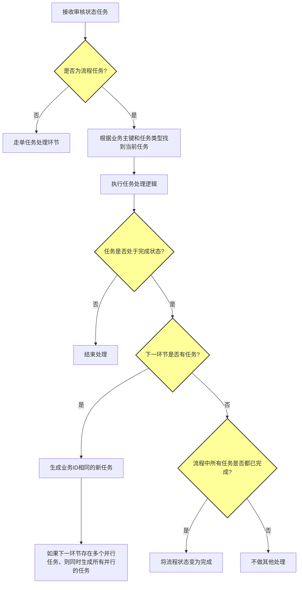

# 流程任务完成业务流程

## 概述
本文档描述了流程任务完成的业务处理逻辑，包括任务类型判断、任务处理、状态检查以及后续任务生成等环节。

## 业务流程

### 完整流程图

### 流程说明

整个流程任务完成的业务流程包含以下主要环节：

1. **任务接收与类型判断**：首先判断接收到的审核状态任务是否为流程任务
2. **流程任务处理**：如果是流程任务，则根据业务主键和任务类型找到当前任务并执行处理
3. **任务状态检查**：检查任务执行后是否处于完成状态
4. **下一环节任务处理**：
   - 如果存在下一环节任务，生成新任务（包括并行任务）
   - 如果不存在下一环节任务，检查整个流程是否完成
5. **流程完成处理**：根据检查结果决定是否将流程状态变为完成

## 详细处理逻辑

### 步骤1：任务类型判断
- 接收审核状态任务
- 判断任务是否为流程任务
  - 如果不是流程任务：进入单任务处理环节
  - 如果是流程任务：进入流程任务处理环节

### 步骤2：流程任务处理
- 根据业务主键和任务类型查找当前任务
- 执行任务处理逻辑
- 检查任务执行后状态
  - 如果任务未完成：结束处理
  - 如果任务已完成：进入步骤3

### 步骤3：下一环节任务处理
- 检查是否存在下一环节任务
  - 如果存在下一环节任务：
    - 生成业务ID相同的新任务
    - 如果下一环节有多个并行任务，同时生成所有并行任务
  - 如果不存在下一环节任务：
    - 检查流程中所有任务是否都已完成
      - 如果所有任务都已完成：将流程状态变为完成
      - 如果存在未完成任务：不做其他处理

## 注意事项

1. 任务类型判断是流程处理的入口，必须准确区分单任务和流程任务
2. 业务主键是关联同一业务流程下不同任务的关键标识
3. 并行任务需要同时生成，确保流程能够并行处理
4. 流程完成状态的变更需要确保所有任务都已处理完毕