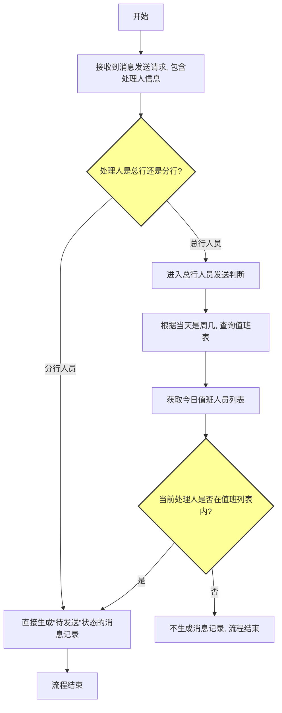
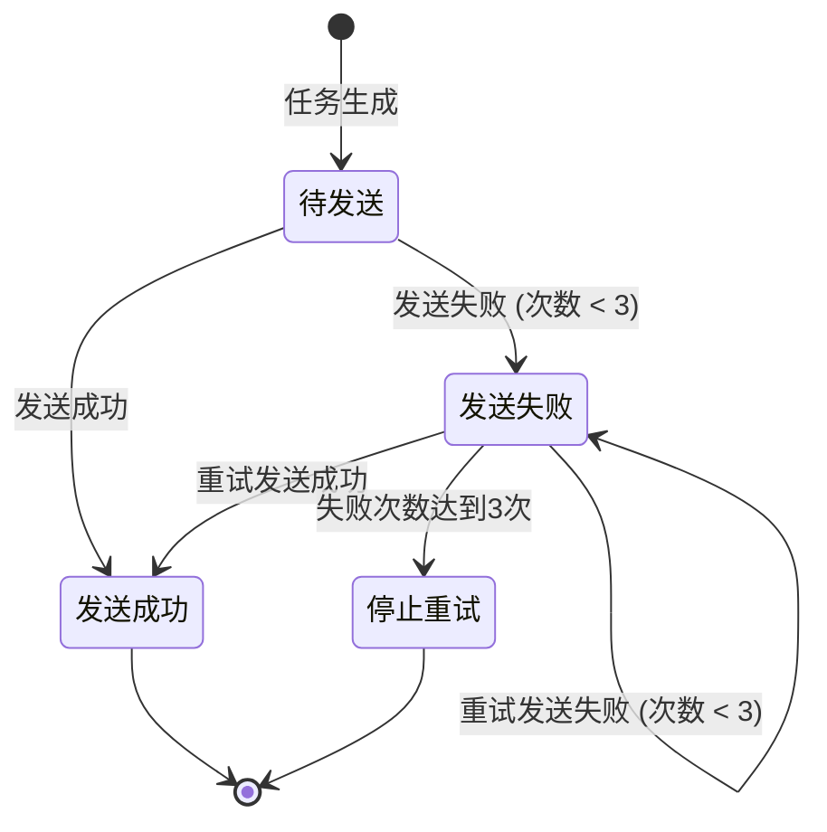

# 消息发送业务流程

## 1. 概述

消息发送流程旨在根据特定的业务规则，为不同类型的用户（总行/分行）生成待发送的消息任务，并通过独立的定时任务系统将消息准确、可靠地推送至“天元”和“招呼”两个外部平台。

### 1.1 业务背景

在日常工作协同中，需要将关键任务、待办、预警等信息及时通知到相关处理人。为了确保消息的精准触达，并对发送过程进行有效管理，特设计此流程。流程需要区分总分行人员的发送规则，并建立可靠的发送和重试机制，以应对外部接口可能出现的异常。

### 1.2 核心目标

- **精准生成**：根据用户类型和值班规则，准确判断是否需要发送消息。
- **可靠发送**：通过异步定时任务和失败重试机制，提高消息发送的成功率。
- **平台解耦**：为“天元”和“招呼”平台建立独立的发送任务，便于维护和扩展。
- **状态可追溯**：完整记录每条消息的发送状态（待发送、成功、失败、停止重试）和重试次数。

### 1.3 适用范围

本流程适用于所有需要向“天元”或“招呼”平台推送通知消息的业务场景，特别是需要对发送规则和发送过程进行精细化管理的场景。

## 2. 流程架构

### 2.1 整体架构

消息发送流程主要包含两个独立但衔接的阶段：

1.  **消息待发送任务生成阶段**：同步判断并创建待发送的消息记录。
2.  **消息发送与重试阶段**：通过异步定时任务消费待发送记录，执行发送和状态更新。

### 2.2 流程架构图

#### 2.2.1 消息待发送任务生成流程



#### 2.2.2 消息发送与重试流程 (以天元平台为例)

```mermaid
graph TD
    subgraph 定时任务 (例如: 每分钟执行一次)
        A[开始] --> B[查询当天状态为“待发送”且平台为“天元”的消息记录]
        B --> C{是否存在待发送记录?}
        C -->|否| D[结束]
        C -->|是| E[遍历每条记录]
        
        E --> F[调用天元平台发送接口]
        F --> G{接口调用是否成功?}
        G -->|是| H[更新消息状态为“发送成功”]
        G -->|否| I[更新消息状态为“发送失败”, 失败次数+1]
        
        I --> J{失败次数 < 3?}
        J -->|是| K[等待下次定时任务重试]
        J -->|否| L[更新消息状态为“停止重试”]
        
        H --> M[处理下一条记录]
        K --> M
        L --> M
        M --> C
    end

    style C fill:#ff9,stroke:#333,stroke-width:2px
    style G fill:#ff9,stroke:#333,stroke-width:2px
    style J fill:#ff9,stroke:#333,stroke-width:2px
```

## 3. 详细流程说明

### 3.1 消息待发送任务生成阶段

#### 3.1.1 输入参数

- `userId`: 待接收消息的用户ID。
- `userType`: 用户类型（总行/分行）。
- `platform`: 目标平台（天元/招呼）。
- `messageContent`: 消息内容。

#### 3.1.2 处理逻辑

1.  **判断用户类型**：
    -   如果 `userType` 为 **分行人员**，直接进入步骤 2。
    -   如果 `userType` 为 **总行人员**，执行以下判断：
        1.  获取当天是周几。
        2.  根据周几查询`值班表`，获取当天的值班人员列表。
        3.  判断当前 `userId` 是否存在于值班人员列表中。
        4.  如果存在，进入步骤 2；如果不存在，则流程结束，不发送消息。
2.  **录入待发送记录**：
    -   在`消息发送记录表`中创建一条新记录。
    -   设置初始状态为 **“待发送”**。
    -   设置初始失败次数为 `0`。
    -   记录 `userId`、`platform`、`messageContent` 等信息。

#### 3.1.3 输出结果

- 成功生成一条状态为“待发送”的消息记录，或不进行任何操作。

### 3.2 消息发送与重试阶段

此阶段由两个独立的定时任务驱动，一个服务于天元平台，一个服务于招呼平台。两者逻辑相同，仅查询的平台标识和调用的接口不同。

#### 3.2.1 触发方式

- **天元消息发送定时任务**：周期性执行（如：每分钟一次）。
- **招呼消息发送定时任务**：周期性执行（如：每分钟一次）。

#### 3.2.2 处理逻辑 (以天元平台为例)

1.  **获取待发送记录**：查询`消息发送记录表`中，满足以下所有条件的记录：
    -   `platform` = '天元'
    -   `status` = '待发送' 或 '发送失败'
    -   `retryCount` < 3
2.  **遍历发送**：对查询到的每条记录执行以下操作：
    1.  调用天元平台的消息发送接口，传入消息内容和接收人信息。
    2.  **处理发送结果**：
        -   **发送成功**：将该记录的 `status` 更新为 **“发送成功”**。
        -   **发送失败**：
            1.  将 `status` 更新为 **“发送失败”**。
            2.  将 `retryCount` (失败次数) 的值加 1。
            3.  检查更新后的 `retryCount`，如果其值达到或超过 3，则将 `status` 更新为 **“停止重试”**。
3.  **记录日志**：在每次发送尝试后，记录详细的操作日志，包括请求、响应、状态变更等。

#### 3.2.3 输出结果

- 待发送消息记录的状态被更新为“发送成功”、“发送失败”或“停止重试”。

## 4. 状态管理

### 4.1 消息记录状态

消息记录包含以下核心状态：

1.  **待发送**：消息已生成，等待定时任务发送。
2.  **发送成功**：消息已成功调用外部平台接口。
3.  **发送失败**：接口调用失败，等待下一次重试。
4.  **停止重试**：失败次数已达上限（3次），不再尝试发送。

### 4.2 状态转换图



## 5. 数据模型

### 5.1 消息发送记录表 (MESSAGE_SEND_LOG)

| 字段名 | 类型 | 描述 |
|--------------|----------|--------------------------------|
| id | String | 记录ID (主键) |
| user_id | String | 接收用户ID |
| platform | String | 目标平台 (tianyuan / zhaohu) |
| content | Text | 消息内容 |
| status | String | 发送状态 (pending, success, failure, stopped) |
| retry_count | Integer | 失败重试次数，默认为0 |
| create_time | Datetime | 创建时间 |
| update_time | Datetime | 最后更新时间 |
| last_error | Text | 最后一次错误信息（可选） |

### 5.2 值班表 (DUTY_SCHEDULE)

| 字段名 | 类型 | 描述 |
|--------------|----------|--------------------|
| id | String | 记录ID (主键) |
| day_of_week | Integer | 周几 (1-7) |
| user_id | String | 值班人员ID |

## 6. 接口与定时任务

### 6.1 外部接口依赖

- **天元平台消息发送接口**：用于向天元平台推送消息。
- **招呼平台消息发送接口**：用于向招呼平台推送消息。

### 6.2 定时任务设计

- **天元发送任务 (TianyuanMessageSenderJob)**：
  - **触发策略**：每分钟执行一次。
  - **核心逻辑**：执行“3.2 消息发送与重试阶段”的逻辑，处理 `platform` 为 '天元' 的记录。
- **招呼发送任务 (ZhaohuMessageSenderJob)**：
  - **触发策略**：每分钟执行一次。
  - **核心逻辑**：执行“3.2 消息发送与重试阶段”的逻辑，处理 `platform` 为 '招呼' 的记录。

## 7. 异常处理

- **业务异常**：
  - `DUTY_SCHEDULE_NOT_CONFIGURED`：当天值班表未配置。应被视为总行人员无需发送，并记录警告日志。
- **系统异常**：
  - `DATABASE_ERROR`：数据库读写异常。定时任务应捕获异常，记录错误日志，并在下个周期继续尝试。
  - `NETWORK_ERROR` / `API_TIMEOUT`：调用外部接口时发生网络错误或超时。此场景由重试机制覆盖，记录错误详情即可。

## 8. 日志记录

- **任务生成日志**：记录每条待发送任务的生成详情，对于因规则（如总行非值班）未生成的情况，建议记录`DEBUG`级别的日志。
- **发送执行日志**：定时任务每次执行时，应记录启动和结束。对每条消息的发送尝试，都应记录其`ID`、目标平台、调用结果（成功/失败）、当前重试次数以及状态变更情况。
- **错误日志**：当发送失败或发生系统异常时，记录详细的错误堆栈和上下文信息。
