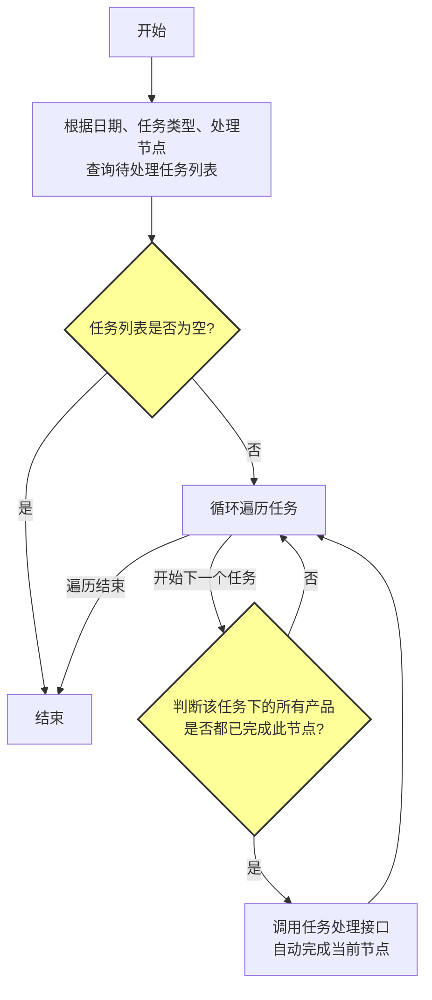

# 自动任务完成流程

## 一、 整体步骤

整体流程旨在实现特定条件下任务节点的自动完成。系统首先根据设定的查询条件（如日期、任务类型、处理节点）筛选出处于“待处理”状态的任务及其处理人信息。随后，系统会逐一检查这些任务，判断其关联的业务产品是否都已满足当前节点的完成条件。如果满足，系统将自动调用任务处理接口，将该任务节点的状态更新为“完成”，从而实现流程的自动化推进。

1.  **查询待处理任务**: 根据 `日期`、`任务类型`、`处理节点` 等信息，查询状态为“待处理”的相同任务，返回任务信息和处理人信息。
2.  **循环判断**: 遍历查询到的任务列表。
3.  **检查完成条件**: 对于每一个任务，判断其关联的所有产品是否都已完成该节点的业务逻辑。
4.  **自动完成**: 如果所有产品均已完成，则系统自动调用任务处理接口，完成当前任务节点。

## 二、 流程图

