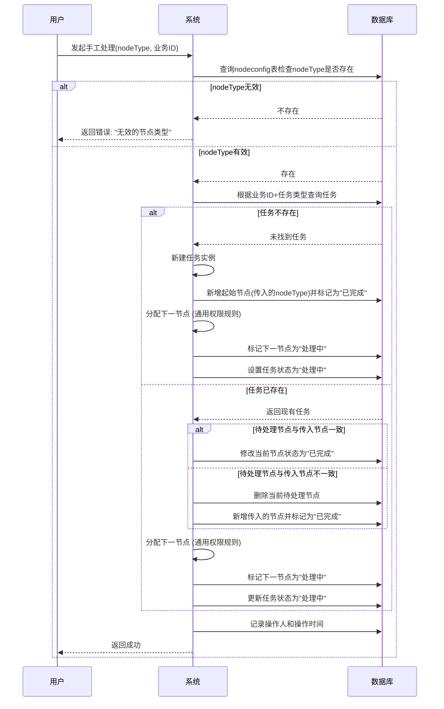

## 手工流程
1. 描述：根据传入的nodeType类型进行手工处理
2. 流程：
   - 验证nodeType有效性：
     * 查询nodeconfig表检查传入的nodeType是否存在
     * 如果不存在则提示错误"无效的节点类型"
   - 任务处理逻辑：
     * 根据业务ID+任务类型查询是否存在现有任务
     * 如果不存在任务：
       + 新建任务实例
       + 新增传入的节点作为起始节点并标记为"已完成"
       + 分配下一节点（遵循通用权限分配规则）
       + 标记下一节点为"处理中"
       + 设置任务状态为"处理中"
     * 如果存在任务：
       + 检查现有任务的待处理节点是否与传入节点一致
       + 如果一致：
         - 修改当前节点状态为"已完成"
       + 如果不一致：
         - 删除当前待处理节点
         - 新增传入的节点类型节点并标记为"已完成"
       + 分配下一节点（遵循通用权限分配规则）
       + 标记下一节点为"处理中"
       + 更新任务状态为"处理中"
   - 记录操作人和操作时间

## 流程图

