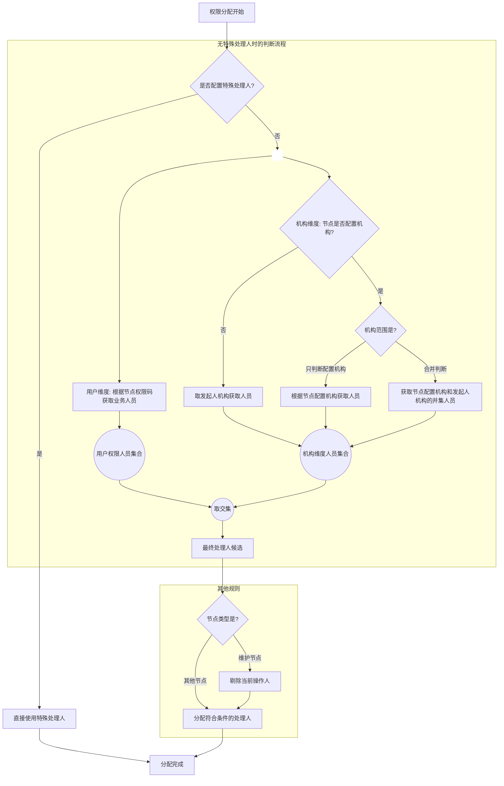

2. 权限分配规则：
   - 特殊处理人优先判断:
     * 当节点配置了特殊处理人时，直接使用特殊处理人作为处理人
     * 跳过后续权限判断流程
   - 无特殊处理人时的权限判断流程:
     * 用户权限维度:
       + 根据节点权限码加上产品代码获取对应的有权限的业务人员
       + 如果产品代码不存在则不控产品维度
     * 机构维度:
       + 如果节点配置中配置了机构且机构范围为"只判断配置机构":
         - 根据节点配置的机构获取机构人员
       + 如果节点配置中配置了机构且机构范围为"合并判断":
         - 获取节点配置机构和发起人机构的并集人员
       + 如果节点机构没有配置:
         - 直接取发起人机构获取人员
     * 取用户权限维度和机构维度的交集作为最终处理人候选
   - 其他规则:
     * 维护节点判断处理人自动剔除当前操作人
     * 其他节点分配处理人无需剔除当前操作人
     * 分配符合条件的处理人

