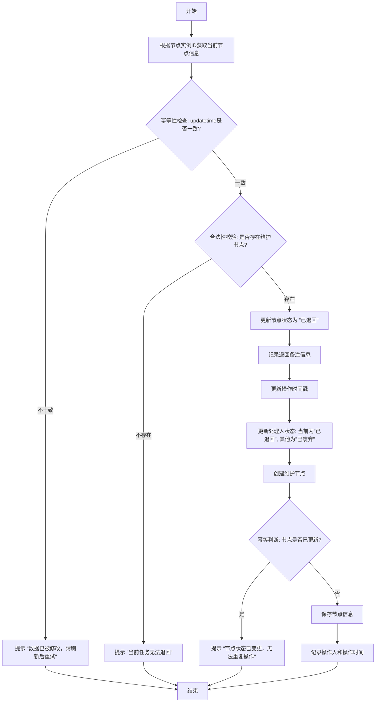

### 退回
1. 描述：将任务节点退回至上一处理环节
2. 流程：
   - 根据节点实例ID获取当前节点信息
   - 幂等性检查：
     * 根据前台传入的updatetime与节点updatetime进行严格比对,如果不一致则提示"数据已被修改，请刷新后重试"
   - 合法性效验:
     * 检查完成节点中是否存在维护节点
     * 如果不存在维护节点则提示"当前任务无法退回"
   - 更新节点状态：
     * 将当前节点状态修改为"已退回"
     * 记录退回备注信息
     * 更新操作时间戳
   - 处理人信息更新：
     * 当前处理人状态更新为"已退回"
     * 其他处理人状态更新为"已废弃"
   - 创建维护节点：
     * 查询完成维护节点的处理人
     * 对该处理人新增维护节点
     * 幂等判断：检查节点的updatetime是否已经更新
     * 如果已经更新则提示"节点状态已变更，无法重复操作"
     * 保存节点信息
   - 记录操作人和操作时间

