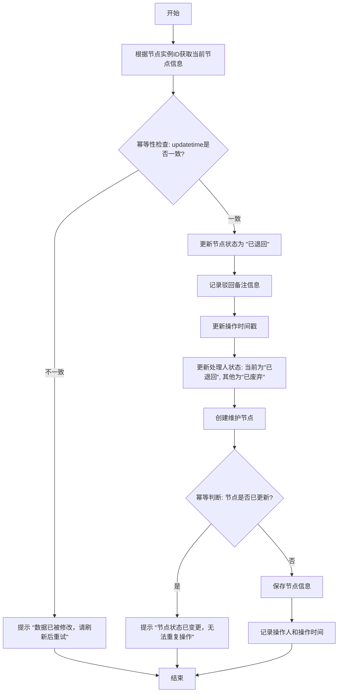

```mermaid
graph TD
    A[开始] --> B[根据节点实例ID获取当前节点信息];
    B --> C{幂等性检查: updatetime是否一致?};
    C -->|不一致| D[提示 &quot;数据已被修改，请刷新后重试&quot;];
    C -->|一致| E[更新节点状态为 &quot;已退回&quot;];
    E --> F[记录驳回备注信息];
    F --> G[更新操作时间戳];
    G --> H[更新处理人状态: 当前为&quot;已退回&quot;, 其他为&quot;已废弃&quot;];
    H --> I[创建维护节点];
    I --> J{幂等判断: 节点是否已更新?};
    J -->|是| K[提示 &quot;节点状态已变更，无法重复操作&quot;];
    J -->|否| L[保存节点信息];
    L --> M[记录操作人和操作时间];

    D --> Z[结束];
    K --> Z;
    M --> Z;
```